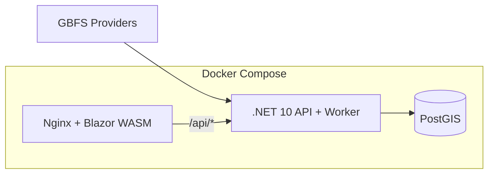

# Umob GBFS Quiz

An assignment solution: ingest GBFS bike-sharing feeds in the background, store spatial data in PostgreSQL/PostGIS, and run a one-minute multiple-choice quiz in a Blazor WebAssembly UI.

## Quick start (one command)

```bash
docker compose up --build
```

Open:

- **Game UI:** http://localhost:8081
- **API health:** http://localhost:8080/api/health
- **OpenAPI / Scalar:** http://localhost:8080/scalar/v1

Wait ~2–3 minutes after startup for the first GBFS ingestion cycle and question pool warmup before starting a game.

## JetBrains Rider

Open `UmobQuiz.sln` at the repository root. For local debugging without Docker:

1. Start PostGIS (e.g. `docker compose up db`).
2. Run **UmobQuiz.Api** (port 8080); EF Core applies migrations on startup.
3. Run **UmobQuiz.Client** and browse the dev server URL.

## Architecture overview



| Component | Role |
|-----------|------|
| **postgis/postgis:16-3.4** | Persistent users, sessions, bikes, stations with `geography(Point,4326)` |
| **UmobQuiz.Api** | Minimal API, JWT auth, game engine, `BackgroundService` GBFS ingestion |
| **UmobQuiz.Client** | Blazor WASM + MudBlazor UI |
| **UmobQuiz.Shared** | Shared DTOs between API and client |

### GBFS providers (from [systems.csv](https://github.com/MobilityData/gbfs/blob/master/systems.csv))

1. **Citi Bike NYC** — `https://gbfs.citibikenyc.com/gbfs/2.3/gbfs.json`
2. **Bicing Barcelona** — `https://barcelona.publicbikesystem.net/customer/gbfs/v3.0/gbfs.json`
3. **Bay Wheels** — `https://gbfs.lyft.com/gbfs/2.3/bay/gbfs.json` (Lyft-operated feed; the legacy `gbfs.baywheels.com` host no longer resolves)

### Data strategy

- A background worker polls feeds every **2 minutes** (never on question request).
- Bikes/stations are **upserted**; missing entities are marked `is_active = false`.
- After each ingestion cycle, a **question pool (~100 items)** is rebuilt in `IMemoryCache`.
- `GET /api/game/{sessionId}/question` serves random cached questions; the correct answer stays server-side in an in-memory session store.

### Question generators (extensible)

The architecture uses pluggable `IQuestionGenerator` implementations:

| Template | Example |
|----------|---------|
| `total_bikes` | How many active bikes does Citi Bike NYC have? |
| `bike_comparison` | Which provider has more active bikes? |
| `total_stations` | How many active stations does Bicing have? |
| `station_comparison` | Which provider has more active stations? |

Add a new class implementing `IQuestionGenerator` and register it in `Program.cs`.

### Game rules

- **60 seconds** per session
- **+50** correct, **-20** wrong
- Session is **Lost** if score drops below 0
- Session is **Won** if score stays ≥ 0 when time ends

### Auth

Simple username/password registration and login with `PasswordHasher<T>` and JWT (no email confirmation).

## API endpoints

| Method | Path | Description |
|--------|------|-------------|
| POST | `/api/auth/register` | Create account |
| POST | `/api/auth/login` | Obtain JWT |
| POST | `/api/game/start` | Start session |
| GET | `/api/game/{id}/question` | Next question |
| POST | `/api/game/{id}/answer` | Submit answer |
| POST | `/api/game/{id}/finish` | End session when timer expires |
| GET | `/api/game/history` | Past sessions (last 20) |
| GET | `/api/game/history/export` | Download your session history as CSV (JWT required; optional `?limit=`, `?includeActive=`, `?from=`, `?to=` ISO UTC; max 10,000 rows; rate-limited) |
| GET | `/api/leaderboard` | Global best-all-time scores (optional `?limit=50`) |

## Future improvements

- Async email export for very large histories
- A separate leaderboard db table for the previous day to calculate actual data starting from the previous day
- Bring the API closer to OAuth and REST
- Use Redis instead of InMemory cache
- A separate table storing the last update time of each feed, instead of the hardcore 2-minute timer
- Integration tests against recorded GBFS fixtures
- Additional question generators (distance between bikes via PostGIS `ST_Distance`, dock availability, etc.)
- Email-free password reset and avatar upload (assignment bonus ideas)
- CI deploy to a hosted environment

## Trade-offs (review talking points)

- **In-memory** session answers and question pool: fast for a 6-hour MVP; would move to Redis/SQL for multi-instance deployments.
- **Text-template questions** from pre-aggregated stats: meets assignment guidance; raw geospatial queries are reserved for future generators.
